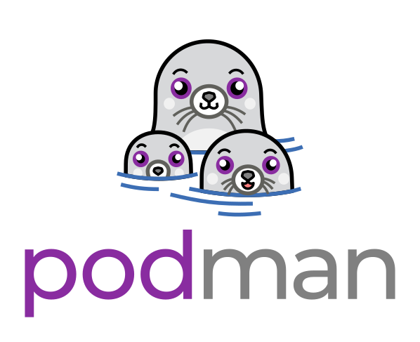

# Table of Contents
1. [Introduction](#introduction)
2. [Detailed Explanation of Podman](#detailed-explanation-of-podman)
   - [Rootless Containers](#rootless-containers)
   - [Daemonless Architecture](#daemonless-architecture)
   - [Compatibility with OCI Standards](#compatibility-with-oci-standards)
   - [ Comman Used Podman Commands](#podman-commands)
   - [Podman Pods](#podman-pods)
   - [Integration with Systemd](#integration-with-systemd)
   - [Security Features](#security-features)
   - [Conclusion](#conclusion)
3. [Installation](#installation)
   - [On Linux](#on-linux)
4. [Podman Commands](#podman-commands) 


# Introduction
Podman (Pod Manager) is a tool for managing containers and pods. It is part of the libpod library and provides a command-line interface similar to Docker. Podman allows you to create, manage, and run containers without requiring a daemon, making it a more secure and lightweight alternative to Docker.

  # Detailed Explanation of Podman

  Podman is a container management tool that provides a command-line interface for managing containers and images. It is designed to be a drop-in replacement for Docker, offering similar functionality but with some key differences. Here is a detailed explanation of how Podman works:

  ### Rootless Containers
  One of the standout features of Podman is its ability to run containers as a non-root user, also known as rootless containers. This enhances security by reducing the risk of privilege escalation attacks. Rootless containers run with user namespaces, allowing users to create and manage containers without requiring root privileges.

  ### Daemonless Architecture
  Unlike Docker, which relies on a central daemon to manage containers, Podman operates in a daemonless architecture. Each container is a child process of the Podman command that started it. This means there is no single point of failure, and users can manage containers without needing a constantly running background service.

  ### Compatibility with OCI Standards
  Podman is fully compatible with the Open Container Initiative (OCI) standards for container runtimes and image formats. This ensures that containers and images created with Podman can be used with other OCI-compliant tools and platforms, providing flexibility and interoperability.

  ### Podman Commands
  Podman offers a comprehensive set of commands for managing containers, images, pods, and volumes. Some of the key commands include:
  - `podman run`: Creates and starts a container from an image.
  - `podman build`: Builds an image using instructions from a Containerfile.
  - `podman push`: Pushes an image to a container registry.
  - `podman pull`: Pulls an image from a container registry.
  - `podman ps`: Lists running containers.
  - `podman stop`: Stops one or more running containers.
  - `podman rm`: Removes one or more stopped containers.
  - `podman rmi`: Removes one or more images from local storage.

  ### Podman Pods
  Podman introduces the concept of pods, which are groups of one or more containers that share the same network namespace. This is similar to the pod concept in Kubernetes. Pods allow for better resource sharing and management of related containers. The `podman pod` command group provides various subcommands for creating, managing, and inspecting pods.

  ### Integration with Systemd
  Podman can generate systemd unit files for containers and pods, allowing them to be managed as systemd services. This integration makes it easier to start, stop, and monitor containers using the familiar systemd interface. The `podman generate systemd` command can be used to create these unit files.

  ### Security Features
  Podman includes several security features to enhance container isolation and protect the host system. These features include:
  - SELinux: Podman supports SELinux to enforce security policies on containers.
  - Seccomp: Podman can use seccomp profiles to restrict the system calls that containers are allowed to make.
  - AppArmor: Podman supports AppArmor profiles to enforce security policies on containers.
  - User Namespaces: Podman uses user namespaces to map container user IDs to different host user IDs, providing an additional layer of isolation.

  ### Conclusion
  Podman is a powerful and flexible container management tool that offers a range of features for managing containers, images, and pods. Its rootless and daemonless architecture, compatibility with OCI standards, and integration with systemd make it a compelling choice for both development and production environments. With its focus on security and ease of use, Podman provides a robust solution for container management.

## Installation
### On Linux
To install Podman on a Linux system, you can use the package manager specific to your distribution. For example, on a Debian-based system, you can use the following commands:
```bash
sudo apt update
sudo apt install podman
## Podman Commands and Their Functionality

Podman provides a variety of commands to manage containers and pods. Here are some of the most commonly used commands and their functionalities:

- `podman run`: This command is used to create and run a container from a specified image. It is similar to `docker run`.
  ```bash
  podman run [OPTIONS] IMAGE [COMMAND] [ARG...]
  ```

- 

These commands provide a comprehensive set of tools to manage containers and pods effectively using Podman.
- `podman attach`: This command attaches to a running container.
  ```bash
  podman attach CONTAINER_ID
  ```

- `podman auto-update`: This command auto-updates containers according to their auto-update policy.
  ```bash
  podman auto-update
  ```

- `podman build`: This command builds an image using instructions from Containerfiles.
  ```bash
  podman build [OPTIONS] PATH
  ```

- `podman commit`: This command creates a new image based on the changed container.
  ```bash
  podman commit [OPTIONS] CONTAINER_ID IMAGE_NAME
  ```

- `podman container`: This command manages containers.
  ```bash
  podman container [COMMAND]
  ```

- `podman cp`: This command copies files/folders between a container and the local filesystem.
  ```bash
  podman cp [OPTIONS] SRC_PATH DEST_PATH
  ```

- `podman create`: This command creates but does not start a container.
  ```bash
  podman create [OPTIONS] IMAGE [COMMAND] [ARG...]
  ```

- `podman diff`: This command displays the changes to the object’s file system.
  ```bash
  podman diff OBJECT_ID
  ```

- `podman events`: This command shows podman system events.
  ```bash
  podman events [OPTIONS]
  ```

- `podman export`: This command exports a container’s filesystem contents as a tar archive.
  ```bash
  podman export [OPTIONS] CONTAINER_ID
  ```

- `podman farm`: This command farms out builds to remote machines.
  ```bash
  podman farm [OPTIONS]
  ```

- `podman generate`: This command generates structured data based on containers, pods, or volumes.
  ```bash
  podman generate [OPTIONS] TYPE
  ```

- `podman healthcheck`: This command manages health checks on containers.
  ```bash
  podman healthcheck [COMMAND]
  ```

- `podman history`: This command shows the history of a specified image.
  ```bash
  podman history [OPTIONS] IMAGE
  ```

- `podman image`: This command manages images.
  ```bash
  podman image [COMMAND]
  ```

- `podman images`: This command lists images in local storage.
  ```bash
  podman images [OPTIONS]
  ```

- `podman import`: This command imports a tarball to create a filesystem image.
  ```bash
  podman import [OPTIONS] PATH
  ```

- `podman info`: This command displays podman system information.
  ```bash
  podman info [OPTIONS]
  ```

- `podman init`: This command initializes one or more containers.
  ```bash
  podman init [OPTIONS] CONTAINER_ID
  ```

- `podman kill`: This command kills one or more running containers with a specific signal.
  ```bash
  podman kill [OPTIONS] CONTAINER_ID
  ```

- `podman kube`: This command plays containers, pods, or volumes from a structured file.
  ```bash
  podman kube [COMMAND]
  ```

- `podman load`: This command loads image(s) from a tar archive.
  ```bash
  podman load [OPTIONS] PATH
  ```

- `podman login`: This command logs in to a container registry.
  ```bash
  podman login [OPTIONS] REGISTRY
  ```

- `podman logout`: This command logs out of a container registry.
  ```bash
  podman logout [OPTIONS] REGISTRY
  ```

- `podman machine`: This command manages a virtual machine.
  ```bash
  podman machine [COMMAND]
  ```

- `podman manifest`: This command manipulates manifest lists and image indexes.
  ```bash
  podman manifest [COMMAND]
  ```

- `podman mount`: This command mounts a working container’s root filesystem.
  ```bash
  podman mount [OPTIONS] CONTAINER_ID
  ```

- `podman network`: This command manages networks.
  ```bash
  podman network [COMMAND]
  ```

- `podman pause`: This command pauses all the processes in one or more containers.
  ```bash
  podman pause [OPTIONS] CONTAINER_ID
  ```

- `podman port`: This command lists port mappings or a specific mapping for the container.
  ```bash
  podman port [OPTIONS] CONTAINER_ID
  ```

- `podman ps`: This command lists containers.
  ```bash
  podman ps [OPTIONS]
  ```

- `podman pull`: This command pulls an image from a registry.
  ```bash
  podman pull [OPTIONS] IMAGE
  ```

- `podman push`: This command pushes an image to a specified destination.
  ```bash
  podman push [OPTIONS] IMAGE DESTINATION
  ```

- `podman rename`: This command renames an existing container.
  ```bash
  podman rename [OPTIONS] CONTAINER_ID NEW_NAME
  ```

- `podman restart`: This command restarts one or more containers.
  ```bash
  podman restart [OPTIONS] CONTAINER_ID
  ```

- `podman run`: This command runs a command in a new container.
  ```bash
  podman run [OPTIONS] IMAGE [COMMAND] [ARG...]
  ```

- `podman save`: This command saves image(s) to an archive.
  ```bash
  podman save [OPTIONS] IMAGE
  ```

- `podman search`: This command searches the registry for an image.
  ```bash
  podman search [OPTIONS] TERM
  ```

- `podman secret`: This command manages secrets.
  ```bash
  podman secret [COMMAND]
  ```

- `podman start`: This command starts one or more containers.
  ```bash
  podman start [OPTIONS] CONTAINER_ID
  ```

- `podman stats`: This command displays a live stream of container resource usage statistics.
  ```bash
  podman stats [OPTIONS]
  ```

- `podman system`: This command manages podman.
  ```bash
  podman system [COMMAND]
  ```

- `podman tag`: This command adds an additional name to a local image.
  ```bash
  podman tag [OPTIONS] IMAGE NEW_NAME
  ```

- `podman top`: This command displays the running processes of a container.
  ```bash
  podman top [OPTIONS] CONTAINER_ID
  ```

- `podman unmount`: This command unmounts a working container’s root filesystem.
  ```bash
  podman unmount [OPTIONS] CONTAINER_ID
  ```

- `podman unpause`: This command unpauses the processes in one or more containers.
  ```bash
  podman unpause [OPTIONS] CONTAINER_ID
  ```

- `podman unshare`: This command runs a command in a modified user namespace.
  ```bash
  podman unshare [OPTIONS] COMMAND [ARG...]
  ```

- `podman untag`: This command removes a name from a local image.
  ```bash
  podman untag [OPTIONS] IMAGE NAME
  ```

- `podman update`: This command updates an existing container.
  ```bash
  podman update [OPTIONS] CONTAINER_ID
  ```

- `podman version`: This command displays the Podman version information.
  ```bash
  podman version
  ```

- `podman volume`: This command manages volumes.
  ```bash
  podman volume [COMMAND]
  ```

- `podman wait`: This command blocks on one or more containers.
  ```bash
  podman wait [OPTIONS] CONTAINER_ID
  ```

 Adding an Image to Podman

To add an image to Podman, you can use the `podman pull` command to download an image from a container registry. Here is a step-by-step guide on how to add an image to Podman:

1. **Search for an Image**: Before pulling an image, you can search for it in a container registry. For example, to search for an image in the Docker Hub registry, you can use the `podman search` command:
   ```bash
   podman search <image_name>
   ```

2. **Pull the Image**: Once you have identified the image you want to add, you can pull it using the `podman pull` command. For example, to pull the `nginx` image from Docker Hub, you can use the following command:
   ```bash
   podman pull docker.io/library/nginx
   ```

3. **Verify the Image**: After pulling the image, you can verify that it has been added to your local storage by using the `podman images` command:
   ```bash
   podman images
   ```

4. **Run a Container from the Image**: To run a container from the image you just pulled, you can use the `podman run` command. For example, to run a container from the `nginx` image, you can use the following command:
   ```bash
   podman run -d -p 80:80 nginx
   ```

By following these steps, you can easily add and use images in Podman.


